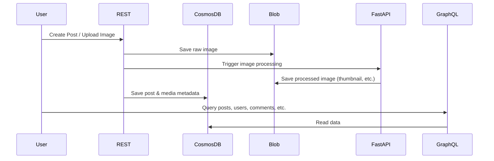

# Social Media App Architecture Diagram

Below is a high-level architecture diagram (text-based) for the entire project, showing how each main component interacts.  
You can use this as a visual reference or export it into a diagram tool (e.g., [Diagrams.net](https://app.diagrams.net/), [Mermaid](https://mermaid-js.github.io/mermaid/#/), etc.) for graphical formats.

---

## **Components Overview**

- **Frontend (Mobile/Web)**
- **REST API (.NET Core)**
- **GraphQL API (Node.js/Express)**
- **Image Processing Microservice (Python/FastAPI)**
- **Azure Services**
  - Cosmos DB (NoSQL)
  - Blob Storage
  - App Service / Containers

---

## **Architecture Flow**

```plaintext
+-------------------------+
|      Frontend App       |
|  (Mobile/Web/SPA)       |
+-----------+-------------+
            |
            v
+-------------------------+
|  REST API (.NET Core)   |<-----------------------------+
|   /api/users            |                              |
|   /api/posts            |                              |
|   /api/comments         |                              |
|   /api/likes            |                              |
|   /api/media/upload     |                              |
+-----------+-------------+                              |
            |                                            |
            v                                            |
+-------------------------+       +---------------------+|
|     Azure Cosmos DB     |<------| GraphQL API         ||
|   (users, posts, etc.)  |       | (Node.js/Express)   ||
+-------------------------+       +---------------------+|
            |                                            |
            v                                            |
+-------------------------+       +---------------------+|
|    Azure Blob Storage   |<------+ Image Processing    ||
|   (raw & processed img) |       | Microservice        ||
+-----------+-------------+       | (Python/FastAPI)    ||
            |                    +---------------------+|
            +--------------------------------------------+

- User uploads image via REST API → image saved to Blob Storage.
- REST API triggers Python service → image processed (resize, thumbnail).
- Python service uploads processed image to Blob Storage.
- REST API updates Cosmos DB with media metadata.

- GraphQL API can query Cosmos DB (users, posts, comments, etc.) for flexible frontend queries.

- All APIs deployed on Azure App Service or Containers.
```

---

## **Sequence Diagram Overview (Mermaid Syntax)**



---

## **Legend**

- **REST API (.NET Core):** Handles CRUD for users, posts, comments, likes, media upload.
- **GraphQL API (Node.js):** Flexible querying for frontend (posts, users, timelines).
- **Python Microservice:** Image manipulation, invoked by REST API.
- **Cosmos DB:** Stores all main app data.
- **Blob Storage:** Persists original and processed media.
- **App Service / Containers:** All APIs/services run here.

---

## **Reference**

- [Azure Cosmos DB](https://learn.microsoft.com/en-us/azure/cosmos-db/)
- [Azure Blob Storage](https://learn.microsoft.com/en-us/azure/storage/blobs/)
- [ASP.NET Core REST API](https://learn.microsoft.com/en-us/aspnet/core/web-api/)
- [Express GraphQL](https://graphql.org/graphql-js/)
- [FastAPI](https://fastapi.tiangolo.com/)